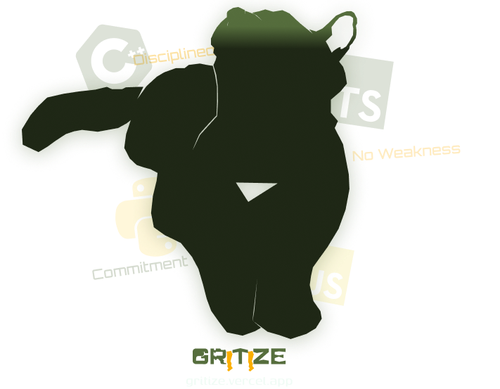

<div align="center">
  
  
  **AI-Powered Technical Interview Preparation Platform**
  
  [](https://gritize.vercel.app)
  [](LICENSE)
  [](https://www.typescriptlang.org/)
  [](https://nextjs.org/)
  
  [Live Demo](https://gritize.vercel.app) • [Documentation](#documentation) • [Contributing](#contributing) • [Report Bug](https://github.com/mojtabababiker/gritize/issues)
</div>

## 🚀 Overview

Gritize is a comprehensive technical interview preparation platform that leverages AI to provide personalized learning experiences. The platform offers structured coding problems, intelligent hints, automated code reviews, and adaptive learning paths to help developers excel in technical interviews.

### ✨ Key Features

- **🤖 AI-Powered Learning**: Google Gemini AI integration for intelligent problem generation, hints, and code reviews
- **📝 Interactive Coding Environment**: Monaco Editor with syntax highlighting and real-time code execution via Piston API
- **🎯 Personalized Learning Paths**: Adaptive quiz system that creates custom study programs based on skill assessment
- **🔍 Comprehensive Problem Library**: coding patterns with curated problems across multiple difficulty levels
- **📊 Progress Tracking**: Detailed analytics and progress visualization for continuous improvement
- **🔐 Secure Authentication**: Multiple auth options including OAuth (GitHub, Google) and traditional email/password
- **💻 Multi-Language Support**: JavaScript, TypeScript, Python, and C++ code execution and review
- **🎨 Modern UI/UX**: Beautiful, responsive design built with Tailwind CSS.

## 🛠️ Tech Stack

### Frontend

- **Framework**: Next.js 15 (App Router, SSR)
- **Language**: TypeScript
- **Styling**: Tailwind CSS
- **UI Components**: React Components & Shadcn/ui
- **Code Editor**: Monaco Editor
- **State Management**: React Hooks & Context

### Backend & Services

- **Database**: Appwrite
- **Authentication**: Appwrite Auth + OAuth providers
- **AI Integration**: Google Gemini AI
- **Code Execution**: Piston API
- **Email**: Nodemailer
- **Validation**: Zod schemas

### Development Tools

- **Package Manager**: pnpm
- **Linting**: ESLint
- **Type Checking**: TypeScript
- **Build Tool**: Next.js built-in bundler

## 🚀 Quick Start

### Prerequisites

- Node.js 15.3 and pnpm
- Appwrite instance (cloud or self-hosted)
- Google AI API key
- Email service credentials (for contact form)

### Installation

1. **Clone the repository**

   ```bash
   git clone https://github.com/mojtabababiker/gritize.git
   cd gritize
   ```

2. **Install dependencies**

   ```bash
   pnpm install
   ```

3. **Environment Setup**

   Copy the content of [.env.example](.env.example) to `.env.local`

   ```bash
   cp .env.example .env.local
   # Configure the environment variables with the required values
   ```

4. **Run the development server**

   ```bash
   pnpm dev
   ```

5. **Open your browser**
   Navigate to [http://localhost:3000](http://localhost:3000)

## 📁 Project Structure

```
gritize/
├── src/
│   ├── app/                      # Next.js App Router
│   │   ├── (landing-page)/       # Home page
│   │   ├── auth/                 # Authentication pages
│   │   ├── dashboard/            # User dashboard
│   │   ├── playground/           # Coding environment
│   │   └── api/                  # API routes
│   ├── components/               # React components
│   │   ├── auth/                 # Authentication components
│   │   ├── dashboard/            # Dashboard components
│   │   ├── playground/           # Code editor & execution
│   │   ├── quiz/                 # Assessment components
│   │   └── ui/                   # Reusable UI components
│   ├── config/                   # Configuration files
│   ├── hooks/                    # Custom React hooks
│   ├── models/                   # Data models & schemas
│   ├── utils/                    # Utility functions
│   └── constant/                 # Application constants
├── Data/                         # Problem Development datasets & patterns
├── public/                       # Static assets
└── components.json               # Shadcn/ui configuration
```

## 🎯 Core Features

### Authentication System

- OAuth integration (GitHub, Google)
- Traditional email/password authentication
- Secure session management with Appwrite

### AI-Powered Learning

- **Problem Generation**: Dynamic problem creation based on coding patterns
- **Intelligent Hints**: Context-aware hints using Google Gemini AI
- **Code Review**: Automated code analysis and improvement suggestions
- **Adaptive Quizzing**: Personalized skill assessment and learning path generation

### Interactive Playground

- Monaco Editor with syntax highlighting
- Real-time code execution via Piston API
- Support for multiple programming languages
- Integrated problem statement and solution tracking

### Progress Analytics

- Comprehensive progress tracking
- Visual analytics and statistics
- Problem completion history
- Performance insights

## 🔧 API Endpoints

| Endpoint                | Method | Description              |
| ----------------------- | ------ | ------------------------ |
| `/api/auth`             | POST   | User authentication      |
| `/api/generate_program` | POST   | AI program generation    |
| `/api/get-problem-hint` | POST   | Get AI-powered hints     |
| `/api/get-code-review`  | POST   | Code review and analysis |
| `/api/submit-code`      | POST   | Submit and execute code  |
| `/api/get-problems`     | GET    | Retrieve problem sets    |
| `/api/testimonials`     | GET    | User testimonials        |

## 🧪 Development

### Available Scripts

```bash
pnpm dev          # Start development server
pnpm build        # Build for production
pnpm start        # Start production server
pnpm lint         # Run ESLint
pnpm type-check   # TypeScript type checking
```

### Code Quality

The project follows strict TypeScript and ESLint configurations for consistent code quality. All components use proper TypeScript interfaces and Zod schemas for runtime validation.

## 🤝 Contributing

We welcome contributions! Please see our [Contributing Guidelines](CONTRIBUTING.md) for details.

### Development Workflow

1. Fork the repository
2. Create a feature branch (`git checkout -b feature/amazing-feature`)
3. Commit your changes (`git commit -m 'Add amazing feature'`)
4. Push to the branch (`git push origin feature/amazing-feature`)
5. Open a Pull Request

### Code Standards

- Follow the existing TypeScript and React patterns
- Use Tailwind CSS for styling
- Implement proper error handling and validation
- Add appropriate comments for complex logic
- Ensure responsive design compatibility

## 📄 License

This project is licensed under the MIT License - see the [LICENSE](LICENSE) file for details.

## 🙏 Acknowledgments

- [Next.js](https://nextjs.org/) for the amazing React framework
- [Appwrite](https://appwrite.io/) for backend services
- [Google AI](https://ai.google.dev/) for AI capabilities
- [Piston API](https://piston.readthedocs.io/) for code execution
- [Shadcn/ui](https://ui.shadcn.com/) for beautiful UI components

## 📞 Support

- 📧 Email: [mojmohammad98@gmail.com](mailto:mojmohammad98@gmail.com)
- 🐛 Issues: [GitHub Issues](https://github.com/mojtabababiker/gritize/issues)
- 💬 Discussions: [GitHub Discussions](https://github.com/mojtabababiker/gritize/discussions)

---

<div align="center">
  Made with ❤️ by the Gritize team
  
  [⭐ Star this repo](https://github.com/mojtabababiker/gritize) if you find it helpful!
</div>
